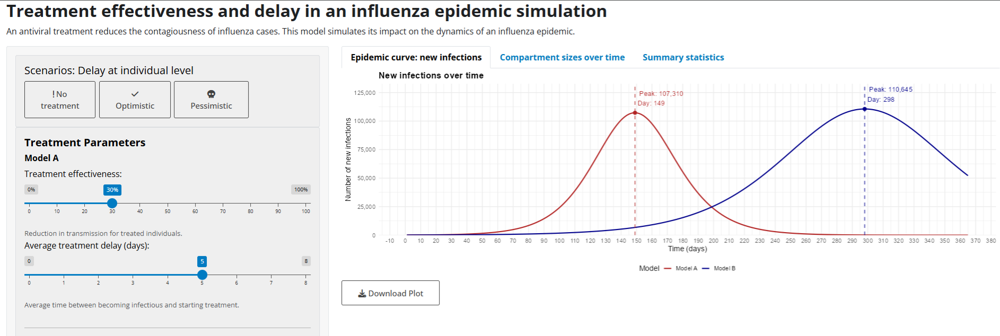
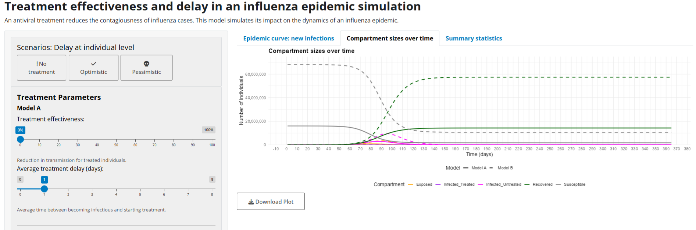

# Epidemic intervention simulator

[](https://shiny.rstudio.com/)
[](https://www.docker.com/)
[](https://opensource.org/licenses/MIT)

A simplified interactive epidemic simulation tool that demonstrates the impact of treatment timing and effectiveness on infectious disease outbreaks.

## Overview

This Shiny web application simulates the dynamics of infectious disease epidemics using a modified SE2IR (Susceptible-Exposed-Infectious[untreated]-Infectious[treated]-Recovered) compartmental model. The simulator allows users to explore how different treatment strategies affect epidemic outcomes across different populations.



### Key Features:

- **Dual model comparison**: Simultaneously compare epidemic trajectories between two populations with different parameters
- **Real-time visualization**: See how changes in treatment timing and effectiveness alter epidemic curves
- **Treatment intervention analysis**: Model the impact of antivirals or other treatments that reduce transmission
- **Comprehensive statistics**: Track peak infections, total cases, and final epidemic state
- **Multiple visualization options**: View new infections or all compartment populations over time
- **Pre-configured scenarios**: Explore optimistic, pessimistic, and no-treatment scenarios



## The Model

The application implements a deterministic compartmental model with five states:

- **S (Susceptible)**: Healthy individuals at risk of infection
- **E (Exposed)**: Infected but not yet infectious (latent period)
- **I₁ (Infectious, Untreated)**: Infectious individuals who have not yet received treatment
- **I₂ (Infectious, Treated)**: Infectious individuals who are receiving treatment with reduced transmission
- **R (Removed)**: Recovered or deceased individuals (no longer infectious)

The model incorporates treatment timing (average delay to treatment) and effectiveness (reduction in transmission) to simulate realistic intervention scenarios.

## Interactive Features

Users can modify parameters including:

- **Treatment effectiveness**: Reduction in transmission for treated individuals (0-100%)
- **Treatment delay**: Average time between becoming infectious and starting treatment (0-8 days)
- **R₀**: Basic reproduction number (average secondary cases per infectious individual)
- **Population size**: Total population for each model scenario
- **Disease progression**: Latency and infectious period durations
- **Visualization options**: Log scale, population normalization, and more

## Getting Started

### Option 1: Run with Docker (Recommended!)

The easiest way to run this application is using Docker, which ensures all dependencies are correctly installed.

#### Prerequisites
- [Docker Desktop](https://www.docker.com/products/docker-desktop/) installed on your computer

#### Quick Start

1. **Pull and run the Docker image:**
   ```bash
   docker pull jcoa05/influenza-treatment-sim:latest
   docker run --rm -p 3838:3838 jcoa05/influenza-treatment-sim:latest
   ```

2. **Open your browser** and navigate to:
   ```
   http://localhost:3838
   ```

3. **Stop the application** by pressing `Ctrl+C` in the terminal

#### Build from Source

If you want to build the Docker image yourself:

```bash
# Clone this repository
git clone https://github.com/jcoa05/seir-shiny
cd YOUR-REPO-NAME

# Build the Docker image
docker build -t influenza-treatment-sim .

# Run the container
docker run --rm -p 3838:3838 influenza-treatment-sim
```

Then visit `http://localhost:3838` in your browser.

### Option 2: Run Locally with R

#### Prerequisites
- R 4.0.0 or higher
- Required packages: shiny, deSolve, ggplot2, tidyr, dplyr, scales, shinyBS, bslib, httpuv

#### Installation

```r
# Clone this repository
git clone https://github.com/jcoa05/seir-shiny

# Navigate to the project directory
cd seir-shiny

# Install required packages
install.packages(c("shiny", "deSolve", "ggplot2", "tidyr", "dplyr", 
                   "scales", "shinyBS", "bslib", "httpuv"))

# Run the application
shiny::runApp("app.R")
```

### Option 3: Online Deployment

The app can be deployed to:
- [shinyapps.io](https://www.shinyapps.io/) for free hosting
- [Posit Connect](https://posit.co/products/enterprise/connect/) for enterprise deployment
- Cloud platforms (AWS, Azure, DigitalOcean) using the included Dockerfile

## Mathematical Foundation

The application uses ordinary differential equations (ODEs) to model disease transmission:

```
dS/dt = -β * S * (I₁ + (1-θ) * I₂) / N
dE/dt = β * S * (I₁ + (1-θ) * I₂) / N - ω * E
dI₁/dt = ω * E - φ * I₁ - γ * I₁
dI₂/dt = φ * I₁ - γ * I₂
dR/dt = γ * I₁ + γ * I₂
```

Where:
- β = transmission rate
- ω = rate of progression from exposed to infectious (1/latency period)
- γ = recovery rate (1/infectious period)
- θ = treatment effectiveness (reduction in transmission)
- φ = rate of treatment initiation (1/treatment delay)
- N = total population

## Docker details

The Docker container is based on the [Rocker Shiny](https://hub.docker.com/r/rocker/shiny) image and includes:

- R 4.3.2
- Shiny Server
- All required R packages pre-installed

## Future Development

Planned enhancements include:

- Stochastic modeling options
- Age-structured populations
- Vaccination interventions
- Hospitalization and healthcare capacity modeling
- Exportable reports and data analysis
- Regional comparison tools

## Contributing

Contributions are welcome! Please feel free to submit a pull Request.

1. Fork the repository
2. Create your feature branch (`git checkout -b feature/amazing-feature`)
3. Commit your changes (`git commit -m 'Add some amazing feature'`)
4. Push to the branch (`git push origin feature/amazing-feature`)
5. Open a Pull Request

## License

This project is licensed under the MIT License.

## Acknowledgments

- Based on epidemiological models developed for public health response planning
- Special thanks to the R and Shiny communities for their excellent documentation and support
- Docker containerization enables reproducible research and easy deployment

*This simulator is intended for educational purposes. Real-world epidemics involve complex social, biological, and environmental factors.*
